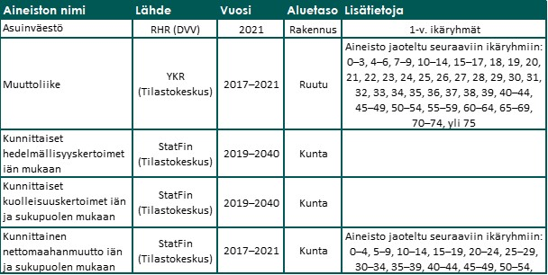
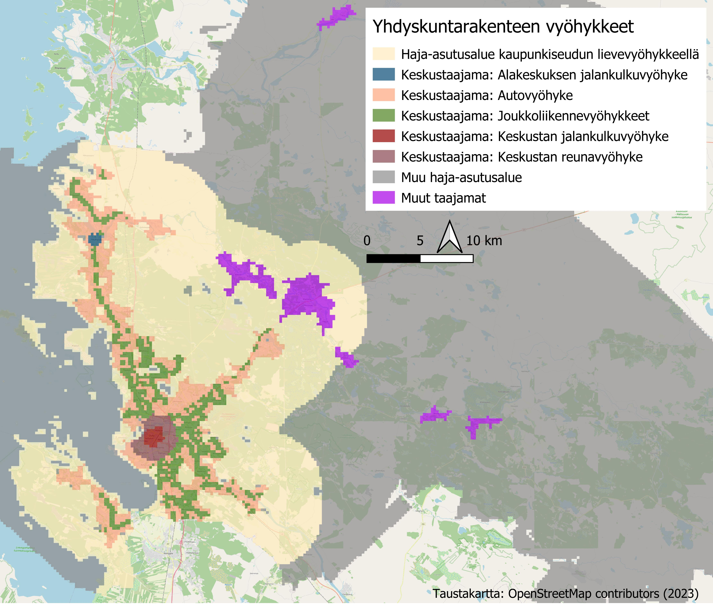
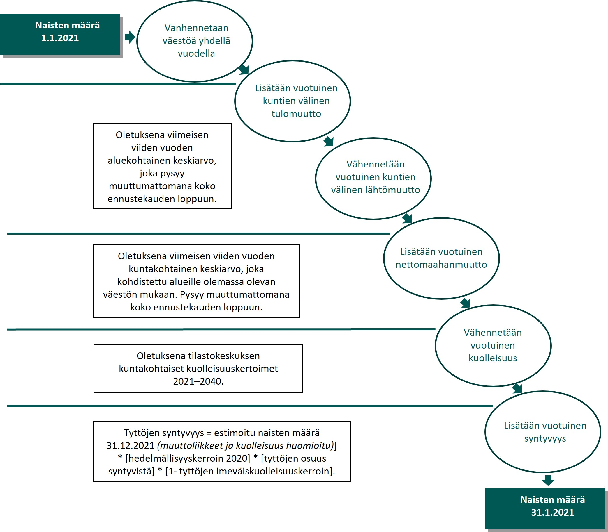
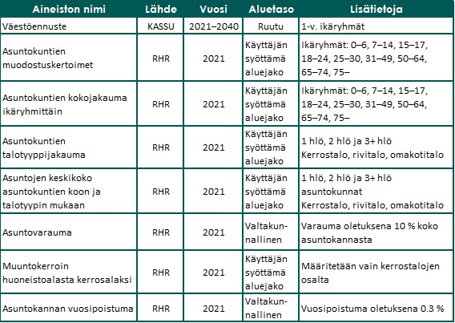

### Taustaa
KASSU-työkalu on kehitetty kuntien asumisen suunnittelun tueksi. Työkalu koostuu väestöennuste- ja asuntokantaennustemallista, ja on tulosta Suomen ympäristökeskuksen (Syke) ja Asumisen rahoitus- ja kehittämiskeskuksen (ARA) yhteishankkeesta. Työkalu on tehty Sykessä. Tarkemmat funktioiden kuvaukset löytyvät R-skripteistä. Lisätietoa työkalusta löytyy: https://helda.helsinki.fi/handle/10138/358430  


### Väestöennuste
Väestöennuste on mallinnettu aluekohtaisesti 1-vuotisikäryhmille, sukupuolittain, kohorttikomponentti-menetelmällä, joka vanhentaa väestöä vuosittain huomioiden eri komponenttien vaikutuksen. Mallin komponentteina toimivat kuntien välinen ja sisäinen muuttoliike, maahanmuutto, kuolleisuus ja syntyvyys. Mallinnuksen pienin alueellinen yksikkö on 250 m x 250 m ruudukko, joten malli mahdollistaa ennusteen kaikille tätä suuremmille aluejaoille (esim. yhdyskuntarakenteen vyöhykejako tai tilastoaluejako). Ennustekausi on tällä hetkellä vuoteen 2040 asti. Laskenta tapahtuu matriisipohjaisesti eli kaikki lähtoaineistot luetaan malliin taulukkomuodossa. 


#### Lähtöaineistot 
Malli käyttää Lähtöaineistoina Rakennus- ja huoneistorekisteriä (RHR) sekä Tilastokeskuksen (TK) tarkempaa ruutukohtaista muuttoliikeaineistoa. Näiden lisäksi hyödynnetään seuraavia avoimia tilastokeskuksen rajapinta-aineistoja: kunnittaiset hedelmällisyyskertoimet ikäluokittain, kuolleisuuskertoimet iän ja sukupuolen mukaan kunnittain sekä maahan- ja maastamuuton kunnittaisia tilastoja iän ja sukupuolen mukaan. Mallissa hyödynnetyt aineistot on merkitty taulukkoon 1.



```{r setup, include=FALSE, echo = FALSE}
knitr::opts_chunk$set(echo = TRUE)

## Clear environment and memory
rm(list = ls())
```

```{r set working directory and load packages, include = FALSE, echo=FALSE}
## Set working directory
setwd("./")

## Load required packages
library(rmarkdown)
library(RODBC)
library(pxweb)
library(dplyr)
library(plyr)
library(odbc)
library(foreach)
library(data.table)

## Exclude scientific values
options(scipen = 999)
```


#### Trendiennusteen luominen Oulun yhdyskuntarakenteen vyöhykkeille
Esimerkissä muodostetaan väestön ja asuntotarpeen trendiennuste Oulun yhdyskuntarakenteen vyöhykkeille (kuva 2). Trendiennuste pohjautuu viimeisen viiden vuoden kehitykseen. 


{width=50% height=50%}

Asetetaan tarvittavat parametrit ennustemallille.
```{r set parameters, results = 'hide', message = FALSE, warning = FALSE}
## Set required parameters ##
##-------------------------##

## database connections ##
server = "server_name"

## Building and dwelling register
rhr = building_and_dwelling_register_source

## Migration data
migration = migration_data_source

## Study area
area = study_area_source

## Number of sub-regions inside the study area (e.g., number of urban zones)
col = 8 

## Count of the age groups. Do not change!
n_ages = 101 

## Starting year of the prediction
start_year = 2021

## Years to be predicted
n_estimation_years = 20

## The years on which the trend prediction is based
## Trend prediction uses mean values from these years to create required variables for population prediction 
pred_years = c(2017, 2018, 2019, 2020, 2021)

## Municipality name 
mun_name = "Oulu" 

## Municipality number
mun_nro = '564'  
```


#### Vaihtoehtoisen skenaarion muodostaminen
Käyttäjä voi muokata ennusteen parametreja ja luoda vaihtoehtoisia skenaarioita trendiennusteen tueksi. Tarkempi kuvaus parametrien muokkauksesta löytyy R-koodeista.
```{r modify inmigration, echo = FALSE, warning = FALSE, include = FALSE}
## Modification of in-migration rate ##
## Tulomuuton muokkaus               ##
##-----------------------------------##
  ## First, create population matrix with value 1. Use this value when creating   trend scenario
  mod_inmig_rate = matrix(1, nrow = n_ages, ncol = col)

  ## Define the yearly change using percentages
  ## e.g. 1.10 = 10% (+)
  ## e.g. (1-0.1) = -10% (-)
  change_per = 1 # 1 is default value
  r_change = c(1:10, 25:40) # rows to be changed (age groups)
  c_change = c(2) # columns to be changed (urban zones)

  ## Adjust the modified rate to desired region and age group
  mod_inmig_rate[r_change, c_change] = mod_inmig_rate[r_change, c_change] * change_per
```

```{r modify outmigration, echo = FALSE, warning = FALSE, include = FALSE}
## Modification of out-migration rate ##
## Lähtömuuton muokkaus               ##
##------------------------------------##
  ## First, create population matrix with value 1. Use this value when creating   trend scenario
  mod_outmig_rate = matrix(1, nrow = n_ages, ncol = col)

  ## Define the change using percentages
  ## e.g. 1.10 = 10% (+)
  ## e.g. (1-0.1) = -10% (-)
  change_per = 1 # 1 is default value
  r_change = c(1:10, 25:40) # rows to be changed (age groups)
  c_change = c(2) # columns to be changed (urban zones)

  ## Adjust the modified rate to desired region and age group
  mod_outmig_rate[r_change, c_change] = mod_outmig_rate[r_change, c_change] *  change_per
```

```{r modify birth rates, echo = FALSE, warning = FALSE, include = FALSE}
## Modification of fertility rate    ##
## Hedelmällisyyskertoimien muokkaus ##
##-----------------------------------##
  ## Define the change using percentages
  ## e.g. 1.10 = 10% (+)
  ## e.g. (1-0.1) = -10% (-)
  ## 1 is default value. Use this in trend scenario.
  mod_fert_rate = 1
```

```{r modify mortality rates, echo = FALSE, include = FALSE}
## Modification of mortality rate ##
## Kuolleisuuskertoimien muokkaus ##
##--------------------------------##
  ## Define the change using percentages
  ## e.g. 1.10 = 10% (+)
  ## e.g. (1-0.1) = -10% (-)
  ## 1 is default value. Use this in trend scenario.
  mod_mort_rate = 1
```


#### Lähtöaineistojen haku

##### Olemassa olevan väestö
Poimitaan Oulun yhdyskuntarakenteen vyöhykkeiden olemassa oleva väestömäärä 1-vuotis ikäryhmittäin. Malli lukee esimerkin tiedot MSsql-tietokannasta hyödyntäen rakennus-ja huoneistorekisterin väestötietoja.
```{r existing population, message = FALSE, warning = FALSE}
## Load source function ##
##----------------------##
source("fun_existing_population.R") ##  Function returns existing population from the study area
```

```{r print example 1, message = FALSE, warning = FALSE, echo = FALSE}
## Print example of the data ##
##---------------------------##
vaesto_rhr = fun_existing_population(area, rhr, col, n_ages)

## Extract males and females
vaesto_naiset = vaesto_rhr$vaesto_naiset
vaesto_miehet = vaesto_rhr$vaesto_miehet

## Load reguired packages
library(knitr)
library(kableExtra)

## Give row names
rownames(vaesto_rhr$vaesto_naiset) = seq(0:100)

vaesto_rhr$vaesto_naiset[1:10,1:col]%>%
  kable(row.names = TRUE, digits=0,
      col.names = c("Alue 1", "Alue 2", "Alue 3", "Alue 4", "Alue 5", "Alue 6", "Alue 7", "Alue 8"),
      caption = "Esimerkki naisten lähtöväestöstä Oulun yhdyskuntarakenteen vyöhykkeillä (lkm ikävuosittain). Esimerkissä vain ensimmäiset 10 ikävuotta",
      format = "html",escape = TRUE) %>%
      kable_styling(full_width = F,position = "left",bootstrap_options = c("striped","minimal"))
```


##### Muuttoliike
Muuttoliike johdetaan Tilastokeskuksen ruutupohjaisesta muuttoliikeaineistosta, josta lasketaan viimeisen viiden vuoden keskiarvo.
```{r load migration function, message = FALSE, warning = FALSE}
## Load source functions ##
##-----------------------##
source("fun_in_migration_female.R") # function returns the amount of female migration in to the study area
source("fun_out_migration_female.R") # function returns the amount of female migration from the study area
source("fun_in_migration_male.R") # function returns the amount of male migration in to the study area
source("fun_out_migration_male.R") # function returns the amount of male migration from the study area
```

```{r print example 2, message = FALSE, warning = FALSE, echo = FALSE}
## Print example of the data ##
##---------------------------##
INPUT_fun_in_migration_female = fun_in_migration_female(area, mod_inmig_rate)

## Give row names
rownames(INPUT_fun_in_migration_female) = seq(0:100)

INPUT_fun_in_migration_female[1:10,1:col]%>%
  kable(row.names = TRUE,digits=0,
      col.names = c("Alue 1", "Alue 2", "Alue 3", "Alue 4", "Alue 5", "Alue 6", "Alue 7", "Alue 8"),
      caption = "Esimerkki naisten vuotuisesta tulomuutosta Oulun yhdyskuntarakenteen vyöhykkeillä (lkm, ikäryhmittäin). Esimerkissä vain ensimmäiset 10 ikävuotta",
      format = "html",escape = FALSE) %>%
      kable_styling(full_width = F,position = "left",bootstrap_options = c("striped","minimal"))
```


##### Maahanmuutto
Maahanmuutto johdetaan kuntakohtaisesta nettomaahanmuutosta Tilastokeskuksen rajapinnasta, josta lasketaan keskiarvo edelliseltä viideltä vuodelta. Koska nettomaahanmuutto on kunnittaista tietoa, jaetaan sen vaikutus osa-alueille suhteessa väestömäärään. Tällöin suurin muuttoliike kohdistuu alueelle, missä on eniten väestöä. 
```{r load immigration function, message = FALSE, warning = FALSE}
## Load source functions ##
##-----------------------##
source("fun_immigration_female.R") # function returns the amount of female net immigration
source("fun_immigration_male.R") # function returns the amount of male net immigration
```

```{r print example 3, message = FALSE, warning = FALSE, echo = FALSE}
## Print example of the data ##
##---------------------------##
INPUT_fun_immigration_female = fun_immigration_female(vaesto_naiset, mun_nro, col)

## Give row names
rownames(INPUT_fun_immigration_female) = seq(0:100)

INPUT_fun_immigration_female[1:10,1:col]%>%
  kable(row.names = TRUE,digits=2,
      col.names = c("Alue 1", "Alue 2", "Alue 3", "Alue 4", "Alue 5", "Alue 6", "Alue 7", "Alue 8"),
      caption = "Esimerkki naisten vuotuisesta maahanmuutosta Oulun yhdyskuntarakenteen vyöhykkeillä (lkm, ikäryhmittäin). Esimerkissä vain ensimmäiset 10 ikävuotta",
      format = "html",escape = FALSE) %>%
      kable_styling(full_width = F,position = "left",bootstrap_options = c("striped","minimal"))
```


##### Kuolleisuus
Kuolleisuus johdetaan kuntakohtaisista naisten ja miesten kuolleisuuskertoimista. Alueen olemassa oleva väestömäärä kuntien välisen muuttoliikkeen ja maahanmuuton jälkeen kerrotaan kuolleisuuskertoimilla, jolloin saadaan poistuva väestönosa. Tämä vähennetään olemassa olevasta väestöstä, jolloin saadaan selville väestömäärä kuolleisuuden jälkeen. Kunnan osa-alueilla käytetään koko kunnan kuolleisuuskertoimia.
```{r load mortality function, message = FALSE, warning = FALSE}
## Load source function ##
##----------------------##
source("fun_mortality.R") # function returns the amount of male and female mortality rates
```

```{r print example 4, message = FALSE, warning = FALSE, echo = FALSE}
## Print example of the data ##
##---------------------------##
INPUT_fun_mortality = fun_mortality(mun_nro, mod_mort_rate)

## Give row names
rownames(INPUT_fun_mortality$mortality_female) = seq(0:100)

INPUT_fun_mortality$mortality_female[1:10,1:col,1]%>%
  kable(row.names = TRUE,digits=4,
      col.names = c("Alue 1", "Alue 2", "Alue 3", "Alue 4", "Alue 5", "Alue 6", "Alue 7", "Alue 8"),
      caption = "Esimerkki naisten kuolleisuuskertoimista ikävuosittain Oulun yhdyskuntarakenteen vyöhykkeillä. Esimerkissä vain ensimmäiset 10 ikävuotta. Kuolleisuuskertoimet on käännetty, jolloin saadaan selville jäljelle jäävä väestönosa",
      format = "html",escape = FALSE) %>%
      kable_styling(full_width = F,position = "left",bootstrap_options = c("striped","minimal"))
```


##### Syntyvyys
Syntyvyys johdetaan kuntakohtaisista hedelmällisyyskertoimista, imeväiskuolleisuudesta, sekä tyttöjen ja poikien osuudesta syntyvistä. Kuntien välisen muuttoliikkeen, maahanmuuton ja kuolleisuuden jälkeen alueen 14-50 -vuotiaiden naisten väestömäärä kerrotaan hedelmällisyyskertoimilla ja tyttöjen ja poikien osuudella syntyvistä. Tästä vähennetään imeväiskuolleisuus, jolloin saadaan kyseisenä vuonna syntyvien tyttöjen ja poikien osuus, jotka lisätään väestöön. Kunnan osa-alueilla käytetään koko kunnan hedelmällisyyskertoimia. 
```{r load birth functions, message = FALSE, warning = FALSE}
## Load source function ##
##----------------------##
source("fun_birth.R") # function returns the amount of male and female birth rates
```

```{r print example 5, message = FALSE, warning = FALSE, echo = FALSE}
## Print example of the data ##
##---------------------------##
INPUT_fun_birth = fun_birth(mun_nro,mod_fert_rate)

## Give row names
rownames(INPUT_fun_birth$birth_female) = seq(14:50)

INPUT_fun_birth$birth_female[1:10,1:col,1]%>%
  kable(row.names = TRUE,digits=4,
      col.names = c("Alue 1", "Alue 2", "Alue 3", "Alue 4", "Alue 5", "Alue 6", "Alue 7", "Alue 8"),
      caption = "Esimerkki naisten hedelmällisyyskertoimista Oulun yhdyskuntarakenteen vyöhykkeillä (prosenttia, ikäryhmittäin). Esimerkissä vain ensimmäiset 10 ikävuotta",
      format = "html",escape = FALSE) %>%
      kable_styling(full_width = F,position = "left",bootstrap_options = c("striped","minimal"))
```


{width=50% height=50%}


#### Väestöennustemallin ajaminen
Malli käyttää yhtä pääfunktiota, joka jakautuu useampaan alifunktioon. Tarkempi kuvaus mllin laskennasta löytyy R-skripteistä.
```{r run population prediction model, warning = FALSE, message = FALSE}
## Run the model   ##
##-----------------##
source("fun_population_prediction.R") 
pop_pred = fun_population_prediction(area, mun_nro, mun_name, rhr, mod_inmig_rate, 
                                         mod_outmig_rate, mod_fert_rate,mod_mort_rate,vaesto_naiset,vaesto_miehet,col)
```

```{r visualize study area, fig.height=5, fig.width=5, echo = FALSE, include = FALSE, warning = FALSE, fig.cap = "Yhdyskuntarakenteen vyohykkeet Oulun kaupungissa."}
## Visualize study area         ##
## Tutkimusalueen visualisointi ##
##------------------------------##
## Load required packages
library(sf)
library(rgdal)
library(rosm)
library(tmap)
library(mapview)

## Connect (cn) to MS SQL-server
cn = odbcDriverConnect(connection="Driver={SQL Server};server=server_name;trusted_connection=yes;", rows_at_time = 1)

## Read study area to be visualized
map=sqlQuery(cn, paste("Select a.*, g.RuutuGeom.STAsText() as geometry 
  From(Select xyind,Alueluokka_nimi,area_id 
    From ",area,") as a 
      Inner Join ",grid_coordinates," g on g.xyind = a.xyind order by area_id asc"))

## Convert to spatial polygons
map = st_as_sf(map, wkt = "geometry", crs = 3067, remove = FALSE)

## Dissolve by [area_id]
map_dissolve = map %>% dplyr::group_by(area_id,Alueluokka_nimi) %>% dplyr::summarize()

## Select variable to be plotted
var = "Alueluokka_nimi"

## Use "plot" mode
tmap_mode("plot") # "view" for interactive window

## Read municipality borders
mun = readOGR("./data/gis/","kunnat_hall_4_5milj")

## Subset AOI
##background_map=subset(mun, mun$KuntaNimi==mun_name)
background_map=subset(mun, mun$SkuntaNimi=='Oulu')

## Create buffer for the study area visualization  in necessary
## background_map = gBuffer(background_map, width=10000, byid=TRUE, quadsegs=30, capStyle="ROUND",joinStyle="ROUND")

## Attach OSM for background map
x = osm.raster(background_map, crop=TRUE)

## Create manual color palette using YKR zones
rgb_auto=rgb(255,167,127, maxColorValue=255) #  Autovyöhyke
rgb_kesk_reun=rgb(135,72,79, maxColorValue=255) # Keskustan reunavyöhyke 
rgb_muu_taaj=rgb(169,0,230,  maxColorValue=255) # Muut taajamat
rgb_joukkol=rgb(77,133,33,maxColorValue=255) # Joukkoliikennevyöhykkeet
rgb_kesk_jalank=rgb(150,0,0, maxColorValue=255) # Keskustan jalankulkuvyöhyke
rgb_alak_jalank=rgb(115,38,0, maxColorValue=255) # Alakeskuksen jalankulkuvyöhyke
rgb_lieve=rgb(255,235,190, maxColorValue=255) # Haja-asutusalue kaupunkiseudun lievevyöhykkeellä
rgb_muu_haja = rgb(204,204,204, maxColorValue=255) # Muu haja-asutusalue

## Plot study area
p=tm_shape(x) + tm_rgb() +
  tm_shape(map_dissolve) + 
  tm_polygons(var, palette = c(
    rgb_kesk_jalank,
    rgb_kesk_reun,
    rgb_alak_jalank,
    rgb_joukkol,
    rgb_auto,
    rgb_muu_taaj,
    rgb_lieve,
    rgb_muu_haja
),
  style = 'cat', title = "Yhdyskuntarakenteen vyohyke",alpha = 0.7) + 
  tm_compass(type="arrow", position=c(.001, .07), size= 2)+
  tm_scale_bar(position = c(.001, .0001), size=.5)+
  tm_legend(position = c("left", "top"))+
  tm_layout(bg.color = "white",frame = TRUE, legend.text.size = .8,legend.title.size = 1.2, legend.width = .8, legend.height = .9, fontfamily = "sans") +
  tmap_options(output.dpi = 500)
p

## Save map
## tmap_save(p3, dpi = 500, width = 6, height = 3, filename = "./tutkimusalue.jpg)
```


### Tulosesimerkkejä
Tulosaineistona syntyy useita erilaisia kuvaajia, visualisointeja ja raakadataa taulukkomuodossa.


#### Väestöennusteen kuvaaja
```{r create population prediction graph, echo=FALSE, fig.height=3, fig.width=6, message=FALSE, warning=FALSE, results='hide', fig.cap= "Kuva 3. Oulun väestöennuste yhdyskuntarakenteen vyöhykkeillä vuoteen 2040 asti"}
## Create population prediction graph ##
##------------------------------------##
## Load required packages 
library(tidyr)
library(ggplot2)

## Create connect (cn) to MS SQL-server
cn = odbcDriverConnect(connection="Driver={SQL Server};server=server_name;trusted_connection=yes;")

## Read study area grids from sql-database
data = sqlQuery(cn, paste("Select Alueluokka_nimi, area_id From ",area,"
group by Alueluokka_nimi, area_id
  order by area_id asc" ))

## Select predicted data to be visualized
## Population
vaesto = pop_pred$`m yhteensa alue`+ pop_pred$`n yhteensa alue`

## Merge study area grids to predictions
data_graph = cbind(data, vaesto)

## Create better column names 
colnames(data_graph)=c("alue","area_id",paste0(start_year-1 + seq(1:n_estimation_years)))
              
## Convert data to long format required for visualization
mean_long = data_graph %>% gather(key = band, value = Vaestoennuste,  paste0(start_year-1 + seq(1:n_estimation_years)))

## Create manual color palette using YKR-zones
rgb_auto=rgb(255,167,127, maxColorValue=255) #  Autovyöhyke
rgb_kesk_reun=rgb(135,72,79, maxColorValue=255) # Keskustan reunavyöhyke 
rgb_muu_taaj=rgb(169,0,230,  maxColorValue=255) # Muut taajamat
rgb_joukkol=rgb(77,133,33,maxColorValue=255) # Joukkoliikennevyöhykkeet
rgb_kesk_jalank=rgb(150,0,0, maxColorValue=255) # Keskustan jalankulkuvyöhyke
rgb_alak_jalank=rgb(115,38,0, maxColorValue=255) # Alakeskuksen jalankulkuvyöhyke
rgb_lieve=rgb(255,235,190, maxColorValue=255) # Haja-asutusalue kaupunkiseudun lievevyöhykkeellä
rgb_muu_haja = rgb(204,204,204, maxColorValue=255) # Muu haja-asutusalue

## Plot data
p2 = ggplot(mean_long, aes(y = Vaestoennuste, x = factor(band, levels = unique(band)), group = alue, col = factor(alue)))+
  geom_line(size=1,linetype=1)+
    #geom_point(size=2)+  
      xlab("Vuosi") + 
        scale_x_discrete(breaks=seq(2021, 2040, 1))+
          scale_y_continuous(breaks=seq(0, 120000 , 20000))+
            ylab("Väestömäärä")+
              labs(color='Yhdyskuntarakenteen vyöhyke')+ 
                ggtitle("Väestöennuste") +
                  theme(text=element_text(size=12, face = "bold",  family="sans") ) +
                    theme_bw()

## Add labels and colors manually
p3 = p2 + scale_color_manual(
                     values = c( "Keskustaajama: Joukkoliikennevyöhykkeet" = rgb_joukkol,
                                 "Haja-asutusalue kaupunkiseudun lievevyöhykkeellä" = rgb_lieve,
                                 "Keskustaajama: Alakeskuksen jalankulkuvyöhyke" = rgb_alak_jalank,
                                 "Keskustaajama: Autovyöhyke" = rgb_auto,
                                 "Keskustaajama: Keskustan jalankulkuvyöhyke" = rgb_kesk_jalank,
                                 "Keskustaajama: Keskustan reunavyöhyke" = rgb_kesk_reun,
                                 "Muu haja-asutusalue" = rgb_muu_haja,
                                 "Muut taajamat" = rgb_muu_taaj
                                     ),
                     ## Set order for the legend
                     limits = c("Keskustaajama: Joukkoliikennevyöhykkeet",
                       "Keskustaajama: Autovyöhyke",
                       "Keskustaajama: Keskustan reunavyöhyke",
                       "Keskustaajama: Keskustan jalankulkuvyöhyke",
                       "Muut taajamat",
                       "Muu haja-asutusalue",
                       "Haja-asutusalue kaupunkiseudun lievevyöhykkeellä",
                       "Keskustaajama: Alakeskuksen jalankulkuvyöhyke"
                                     ),
                     labels = c(
                       "Joukkoliikennevyöhyke",
                       "Autovyöhyke",
                       "Keskustan reunavyöhyke",
                       "Keskustan jalankulkuvyöhyke",
                       "Muu taajama",
                       "Muu haja-asutusalue",
                       "Lievevyöhyke",
                       "Alakeskuksen jalankulkuvyöhyke"
                     ))
                    
## Print example figure
p3

## Save plot
## ggsave(p3, dpi = 500, width = 6, height = 3, filename = "./väestöennuste.jpg)
```


#### Väestöpyramidi
```{r Create population pyramid, echo = FALSE, fig.width = 4, fig.height = 4, message=FALSE, warning=FALSE, fig.cap= "Kuva 4. KASSU-mallin tuottama väestöpyramidi verrattuna Tilastokeskuksen väestöpyramidiin (harmaa viiva)"}
## Create population pyramid ##
##---------------------------##

## Load TK population prediction data 
## PXWEB query 
pxweb_query_list = 
    list("Alue"=c(paste0("KU",mun_nro)),
         "Vuosi" = c ('*'),
         "Sukupuoli" = c('1','2'), 
         "Ikä" = c('*'),
         "Tiedot" = c("vaesto_e21"))

  ## Download data 
  px_data = 
    pxweb_get(url = "https://statfin.stat.fi/PXWeb/api/v1/fi/StatFin/vaenn/statfin_vaenn_pxt_139f.px",
      query = pxweb_query_list)
  
## Convert to data.frame 
tk_pop_data = as.data.frame(px_data, column.name.type = "text", variable.value.type = "text")  

## Drop row  [yhteensä] and column [alue]
tk_pop_data<-subset(tk_pop_data, Ikä!='Yhteensä')
drop <- c("Alue")
tk_pop_data = tk_pop_data[,!(names(tk_pop_data) %in% drop)]

## Give better column names
colnames(tk_pop_data) = c("Vuosi","Sukupuoli","Ikä","väestömäärä_tk")

## Select years to be plotted
tk_pop_data = tk_pop_data[tk_pop_data$Vuosi %in% c(paste0(start_year-1 + seq(1:n_estimation_years))),]

## Read KASSU population estimation as data frame
kassu_pop_data_m = as.data.frame(pop_pred$`m ikavuosittain kunta`)
kassu_pop_data_f = as.data.frame(pop_pred$`n ikavuosittain kunta`)

## Add columns [sukupuoli], [ikä]
kassu_pop_data_m$Sukupuoli = 'Miehet'
kassu_pop_data_m$Ikä = 0:100 

kassu_pop_data_f$Sukupuoli = 'Naiset'
kassu_pop_data_f$Ikä = 0:100 

## Combine data
kassu_pop_data = rbind(kassu_pop_data_m,kassu_pop_data_f)

## Give better column names
colnames(kassu_pop_data) = c(paste0(start_year-1 + seq(1:n_estimation_years)), "Sukupuoli","Ikä")

## Convert data to long format required for visualization
kassu_pop_data = kassu_pop_data%>% gather(key = Vuosi, value = väestömäärä_kassu, paste0(start_year-1 + seq(1:n_estimation_years)))

## bind KASSU and TK estimations
pop_data = cbind(kassu_pop_data,tk_pop_data$väestömäärä_tk)

## Give better column names
colnames(pop_data) = c("Sukupuoli","Ikä","Vuosi","väestömäärä_kassu","väestömäärä_tk")

## load library ggplot2 and dplyr
library(ggplot2)
library(dplyr)

## Select data year to be plotted
p_pop_data = subset(pop_data, pop_data$Vuosi == 2025)
  
## Set male population to negative
p_pop_data = p_pop_data %>% mutate(väestömäärä_kassu = ifelse(Sukupuoli=="Miehet", väestömäärä_kassu*(-1),
                        väestömäärä_kassu*1)) %>%
             mutate(väestömäärä_tk = ifelse(Sukupuoli=="Miehet", väestömäärä_tk*(-1),
                        väestömäärä_tk*1))

## Plot population pyramid
p4 = ggplot(p_pop_data) + 
  geom_bar(aes(x=Ikä, y=väestömäärä_kassu, fill = Sukupuoli),stat="identity") +
  scale_fill_manual(values = c("#3c7640","#A1BCA3")) +
  scale_y_continuous(breaks = seq(-1000, 1000, 1000)) +
  geom_line(aes(x=Ikä, y=väestömäärä_tk, fill = Sukupuoli),stat="identity", size = 1, color="#444444") +
  labs(title= "Väestöennuste 2025 - Oulu",
       x="Ikä",y="Väestömäärä",
       caption = "Lähde: SYKE/Tilastokeskus") + 
  coord_flip() + 
  theme_minimal()+
  theme(plot.margin = unit(c(1,1,1,1), "cm"),
        plot.title = element_text(size = 8, face = "bold", hjust = 0.5, vjust = 4),
        legend.title=element_blank(),
        axis.text.x = element_text(size = 8),
        axis.text.y = element_text(size =8),
        axis.title.x= element_text(size=8),
        axis.title.y=element_text(size=8),
        plot.caption = element_text(size = 8, color = "grey50", hjust = 1),
        legend.text=element_text(size=8))
p4

## Save plot
## ggsave(p4, dpi = 500, width =8, height = 10,filename = "./väestöpyramidi.jpg")
```


#### Väestönmuutos kartalla alueittain
```{r Visualize population prediction on a map, echo = FALSE, warning = FALSE, message=FALSE, fig.width = 5, fig.height = 5,  fig.cap= "Kuva 4. Oulun ennustettu väestönmuutos yhdyskuntarakenteen vyöhykkeillä vuodesta 2021 vuoteen 2040 asti"}
## Create population prediction map ##
## Load required packages
library(rgdal)
library(tmap)
library(mapview)
library(rosm)
library(rgeos)
library(sf)
library(terra)

## Connect (cn) to MS SQL-server
cn = odbcDriverConnect(connection="Driver={SQL Server};server=server_name;trusted_connection=yes;", rows_at_time = 1)

## Read regions to be visualized
alue_map=sqlQuery(cn, paste("Select a.*, g.RuutuGeom.STAsText() as geometry 
  From(Select xyind,Alueluokka_nimi,area_id
    From ",area,") as a
  Inner Join ",grid_coordinates," g on g.xyind = a.xyind
  order by area_id asc"))

## Convert to spatial polygons
alue_map = st_as_sf(alue_map, wkt = "geometry", crs = 3067, remove = FALSE)

## Dissolve by [area_id]
alue_map_dissolve = alue_map %>% dplyr::group_by(area_id,Alueluokka_nimi) %>% dplyr::summarize()

## Select data to be visualized
vaesto=pop_pred$`m yhteensa alue`+ pop_pred$ `n yhteensa alue`

## Merge prediction data to the regions
alue_map_dissolve=merge(alue_map_dissolve, vaesto, by.x="area_id", by.y="row.names" )
## alue_map_dissolve=cbind(alue_map_dissolve, vaesto)

## Create better column names 
colnames(alue_map_dissolve)=c("area_id","Alueluokka_nimi",paste0(start_year-1 + seq(1:n_estimation_years)),"geometry")

## Calculate population change in time
alue_map_dissolve$'c2022'=alue_map_dissolve$`2022`-alue_map_dissolve$`2021`
alue_map_dissolve$'c2023'=alue_map_dissolve$`2023`-alue_map_dissolve$`2021`
alue_map_dissolve$'c2024'=alue_map_dissolve$`2024`-alue_map_dissolve$`2021`
alue_map_dissolve$'c2025'=alue_map_dissolve$`2025`-alue_map_dissolve$`2021`
alue_map_dissolve$'c2026'=alue_map_dissolve$`2026`-alue_map_dissolve$`2021`
alue_map_dissolve$'c2027'=alue_map_dissolve$`2027`-alue_map_dissolve$`2021`
alue_map_dissolve$'c2028'=alue_map_dissolve$`2028`-alue_map_dissolve$`2021`
alue_map_dissolve$'c2029'=alue_map_dissolve$`2029`-alue_map_dissolve$`2021`
alue_map_dissolve$'c2030'=alue_map_dissolve$`2030`-alue_map_dissolve$`2021`
alue_map_dissolve$'c2031'=alue_map_dissolve$`2031`-alue_map_dissolve$`2021`
alue_map_dissolve$'c2032'=alue_map_dissolve$`2032`-alue_map_dissolve$`2021`
alue_map_dissolve$'c2033'=alue_map_dissolve$`2033`-alue_map_dissolve$`2021`
alue_map_dissolve$'c2034'=alue_map_dissolve$`2034`-alue_map_dissolve$`2021`
alue_map_dissolve$'c2035'=alue_map_dissolve$`2035`-alue_map_dissolve$`2021`
alue_map_dissolve$'c2036'=alue_map_dissolve$`2036`-alue_map_dissolve$`2021`
alue_map_dissolve$'c2037'=alue_map_dissolve$`2037`-alue_map_dissolve$`2021`
alue_map_dissolve$'c2038'=alue_map_dissolve$`2038`-alue_map_dissolve$`2021`
alue_map_dissolve$'c2039'=alue_map_dissolve$`2039`-alue_map_dissolve$`2021`
alue_map_dissolve$'c2040'=alue_map_dissolve$`2040`-alue_map_dissolve$`2021`

## Choose prediction years to be plotted
var = '2021'
var2 ='c2040'

## Use "plot" mode
tmap_mode("plot") # "view" for interactive window

## Read municipality borders
mun = readOGR("./data/gis/","kunnat_hall_4_5milj", verbose = FALSE)

## Subset AOI
background_map=subset(mun, mun$KuntaNimi==mun_name)

## Create buffer in necessary
## background_map = gBuffer(background_map, width=10000, byid=TRUE, quadsegs=30, capStyle="ROUND",joinStyle="ROUND")

## Attach OSM for background map
x = osm.raster(background_map, crop=TRUE)

## See available palettes
## tmaptools::palette_explorer()

## Set color palette for YKR-data
## Order is taken from values (lowest to highest)
palette1 = c(
  rgb_lieve,
  rgb_muu_taaj,
  rgb_muu_haja,
  rgb_alak_jalank,
  rgb_kesk_reun,
  rgb_kesk_jalank,
  rgb_auto,
  rgb_joukkol
)

## Comparison year
p5=tm_shape(x) + tm_rgb() +
tm_shape(alue_map_dissolve) + 
  #change tm_fill = tm_polygons to include grid outlines
  tm_polygons(var2, palette = palette1, style = 'cat', title = "Väestönmuutos 2021-2040",alpha = 0.7) + 
  tm_compass(type="arrow", position=c(.001, .07), size= 2)+
  tm_scale_bar(position = c(.001, .0001), size=.5)+
  tm_legend(position = c("left", "top"))+
  tm_layout(bg.color = "transparent",frame = TRUE,legend.text.size = 1,legend.title.size = 1.2, legend.width = .8, legend.height = .9, fontfamily = "sans" ) +
  tmap_options(output.dpi = 500)
p5
##tmap_arrange(p1, p2)

## Save an image
## tmap_save(p5, dpi = 500, width =5, height = 5,filename = "./väestönmuutoskartta.jpg")
```

```{r Write data to Excel, include = FALSE, echo=FALSE}
## Write results to Excel             ## 
## Raakadatan kirjoittaminen Exceliin ##
##------------------------------------## 
## Load required packages
library(openxlsx)

## Create Excel workbook
wb = createWorkbook()

## Extract data 
dataframe1=data.frame(pop_pred$`m yhteensa alue`+pop_pred$`n yhteensa alue`)
colnames(dataframe1)= c(paste0(start_year-1 + seq(1:n_estimation_years)))
rownames(dataframe1)=c(paste0("Alue", seq(1:col))) 
dataframe2=data.frame(pop_pred$`m yhteensa kunta` + pop_pred$`n yhteensa kunta`)
colnames(dataframe2)= c("Väestöennuste kunta")
rownames(dataframe2)=c(paste0(start_year + seq(1:n_estimation_years))) 
dataframe3=data.frame(pop_pred$`m nettomuutto alue yht` + pop_pred$`n nettomuutto alue yht`)
colnames(dataframe3)= c(paste0(start_year + seq(1:n_estimation_years)))
rownames(dataframe3)=c(paste0("Alue", seq(1:col))) 
dataframe4=data.frame(pop_pred$`m nettomuutto kunta yht` + pop_pred$`n nettomuutto kunta yht`)
colnames(dataframe4)= c("Nettomuutto kunta")
rownames(dataframe4)=c(paste0(start_year + seq(1:n_estimation_years))) 
dataframe5=data.frame(pop_pred$`m nettomaahanmuutto alue yht` + pop_pred$`n nettomaahanmuutto alue yht`)
colnames(dataframe5)= c(paste0(start_year + seq(1:n_estimation_years)))
rownames(dataframe5)=c(paste0("Alue", seq(1:col))) 
dataframe6=data.frame(pop_pred$`m nettomaahanmuutto kunta yht` + pop_pred$`n nettomaahanmuutto kunta yht`)
colnames(dataframe6)=c("Nettomaahanmuutto kunta")
rownames(dataframe6)=c(paste0(start_year + seq(1:n_estimation_years))) 
dataframe7=data.frame(pop_pred$`m kuolleisuus alue yht` + pop_pred$`n kuolleisuus alue yht`)
colnames(dataframe7)= c(paste0(start_year + seq(1:n_estimation_years)))
rownames(dataframe7)=c(paste0("Alue", seq(1:col))) 
dataframe8=data.frame(pop_pred$`m kuolleisuus kunta yht` + pop_pred$`n kuolleisuus kunta yht`)
colnames(dataframe8)= c("Kuolleisuus kunta")
rownames(dataframe8)=c(paste0(start_year + seq(1:n_estimation_years))) 
dataframe9=data.frame(pop_pred$`m syntyvyys alue yht` + pop_pred$`n syntyvyys alue yht`)
colnames(dataframe9)=c(paste0(start_year + seq(1:n_estimation_years)))
rownames(dataframe9)=c(paste0("Alue", seq(1:col))) 
dataframe10=data.frame(pop_pred$`m syntyvyys kunta yht` + pop_pred$`n syntyvyys kunta yht`)
colnames(dataframe10)= c("Syntyvyys kunta")
rownames(dataframe10)=c(paste0(start_year + seq(1:n_estimation_years))) 

## Add Excel-sheets with names
addWorksheet(wb, "väestöennuste alue")
addWorksheet(wb, "väestöennuste kunta")
addWorksheet(wb, "nettomuutto alue")
addWorksheet(wb, "nettomuutto kunta")
addWorksheet(wb, "nettomaahanmuutto alue")
addWorksheet(wb, "nettomaahanmuutto kunta")
addWorksheet(wb, "kuolleisuus alue")
addWorksheet(wb, "kuolleisuus kunta")
addWorksheet(wb, "syntyvyys alue")
addWorksheet(wb, "syntyvyys kunta")

## Add data corresponding sheet name
writeData(wb, 1, dataframe1, rowNames = TRUE)
writeData(wb, 2, dataframe2, rowNames = TRUE)
writeData(wb, 3, dataframe3, rowNames = TRUE)
writeData(wb, 4, dataframe4, rowNames = TRUE)
writeData(wb, 5, dataframe5, rowNames = TRUE)
writeData(wb, 6, dataframe6, rowNames = TRUE)
writeData(wb, 7, dataframe7, rowNames = TRUE)
writeData(wb, 8, dataframe8, rowNames = TRUE)
writeData(wb, 9, dataframe9, rowNames = TRUE)
writeData(wb, 10, dataframe10, rowNames = TRUE)

## Write Excel out
## saveWorkbook(wb, file = "./väestöennuste_2021_2040_oulu_trendiskenaario.xlsx", overwrite = TRUE)
```


### Asuntotarve-ennuste


Asuntotarve-ennuste johdetaan muodostetun väestöennusteen pohjalta niin, että naisia ja miehiä käsitellään laskennassa tästä eteenpäin yhdessä. Ennuste voidaan tuottaa tällä hetkellä vuoteen 2040 asti. Mallin tuottama asuntokantaennuste käyttää lähtöaineistoina lisäksi ja rakennus- ja huoneistorekisteriä (RHR), jonka pohjalta se muodostaa ennusteeseen tarvittavat lähtömuuttujat (taulukko 2). Ennuste voidaan tuottaa tällä hetkellä vuoteen 2040 asti.





Malli luokittelee tuotetun väestöennusteen aluksi yhdeksään ikäryhmään. Väestön muuntaminen asuntokunniksi tapahtuu kertomalla väestöennuste asuntokuntien muodostuskertoimien perusteella. Tämän jälkeen asuntokunnat jaetaan kolmeen luokkaan (1 hlö, 2 hlö ja 3+ hlö) lähtövuoden asuntokuntien kokojakauman perusteella. Nykyjakauma toimii oletusarvona koko ennustekaudelle. Näin saadaan asuntokuntien kokonaismäärät ikäryhmittäin eri asuntokuntien kokoluokissa (1 hlö, 2 hlö ja 3+ henkilön asuntokunnat).

Asuntokunnat summataan yhteen asuntokuntien koon mukaan, jolloin saadaan selville asuntokuntien kokonaismäärä. Kokonaismäärä jaetaan eri talotyyppeihin (kerrostalo, rivitalo, omakotitalo) lähtövuoden talotyyppijakauman perusteella. Muodostunut asuntokuntien määrä talotyypeittäin muutetaan asunnoiksi lähtövuoden asuntojen keskikokojakauman mukaan, jolloin saadaan lopullinen, ennusteen mukainen asuntojen määrä. Kokojakaumaa käytetään oletuksena koko ennustekauden loppuun.

Tämän jälkeen huomioidaan asuntovarauma eli vailla vakituisia asukkaita olevat asunnot. Varauman suuruudeksi on oletusarvona asetettu 10 % koko asuntokannasta, mikä on valtakunnallinen RHR:stä laskettu keskiarvo. Tämän jälkeen huomioidaan vielä asuntokannan vuosipoistuma, joka on oletuksena 0,3 % asunto-kannasta. Vertaamalla väestöennusteen perusteella tuotettua asuntojen määrää olemassa olevaan, lähtövuoden asuntojen määrään (RHR), voidaan tehdä aluekohtainen arvio tuotanto- tai vähennystarpeesta talotyypeittäin. Jos olemassa oleva kanta on suurempi kuin ennustettu asuntomäärä esitetään vähennystarvetta, ja päinvastaisessa tilanteessa taas tuotantotarvetta.


#### Lähtöaineistojen haku

##### Aluekohtainen väestöennuste
```{r house prediction input data, warning = FALSE, message = FALSE}
## Load population prediction ##
##----------------------------##
population_prediction = pop_pred$`n ikavuosittain alue`+ pop_pred$`m ikavuosittain alue`
```


##### Asuntokuntien kokojakauma
```{r family size, warning = FALSE, message = FALSE}
## Load source function ##
##-----------------------##
source("fun_familysize.R") # Function returns size of household-dwelling unit ##
```

```{r print example 6, message = FALSE, warning = FALSE, echo = FALSE}
## Print example of the data ##
##---------------------------##
INPUT_family_size = fun_familysize(start_year, rhr, area, col)

INPUT_family_size[,,1]%>%
  kable(row.names = TRUE,digits=4,
      #col.names = c("Alue 1", "Alue 2", "Alue 3"),
      caption = "Esimerkki asuntokuntien kokojakaumasta keskustan jalankulkuvyöhykkeellä Oulussa perhekoon mukaan ikäryhmittäin.",
      format = "html",escape = FALSE) %>%
      kable_styling(full_width = F,position = "left",bootstrap_options = c("striped","minimal"))
```


##### Asuntokuntien muodostumiskertoimet 
```{r household rates, warning = FALSE, message = FALSE}
## Load source function ##
##----------------------##
source("fun_household_rates.R") ##  Function returns household rates in different age groups
```

```{r print example 7, message = FALSE, warning = FALSE, echo = FALSE}
## Print example of the data ##
##---------------------------##
INPUT_household_rates = fun_household_rates(start_year, rhr, area, col)

INPUT_household_rates[,1,1]%>%
  kable(row.names = TRUE,digits=4,
      col.names = c("Kerroin"),
      caption = "Esimerkki asuntokuntien muodostumiskertoimesta keskustan jalankulkuvyöhykkeellä Oulussa ikäryhmittäin.",
      format = "html",escape = FALSE) %>%
      kable_styling(full_width = F,position = "left",bootstrap_options = c("striped","minimal"))
```


##### Asuntokuntien jakautuminen talotyypeittäin
```{r household and house type, warning = FALSE, message = FALSE}
## Load source function ##
##----------------------##
source("fun_household_housetype_distribution.R") ## Function returns percentage of different households and house types 
```

```{r print example 8, message = FALSE, warning = FALSE, echo = FALSE}
## Print example of the data ##
##---------------------------##
INPUT_household_housetype_distribution = fun_household_housetype_distribution(start_year, rhr, area, col)

INPUT_household_housetype_distribution[,,1]%>%
  kable(row.names = TRUE,digits=4,
      col.names = c("Omakotitalo", "Rivitalo", "Kerrostalo"),
      caption = "Esimerkki asuntokuntien jakautumisesta talotyypeittäin keskustan jalankulkuvyöhykkeellä Oulussa.",
      format = "html",escape = FALSE) %>%
      kable_styling(full_width = F,position = "left",bootstrap_options = c("striped","minimal"))
```


##### Asuntokuntien keskimääräinen pinta-ala talotyypeittäin 
```{r household mean size, warning = FALSE, message = FALSE}
## Load source function ##
##----------------------##
source("fun_household_meansize.R") ## Function returns mean size of different households (m2) 
```

```{r print example 9, message = FALSE, warning = FALSE, echo = FALSE}
## Print example of the data ##
##---------------------------##
INPUT_household_meansize = fun_household_meansize(start_year, rhr, area, col)

INPUT_household_meansize[,,1]%>%
  kable(row.names = TRUE,digits=4,
      col.names = c("Omakotitalo", "Rivitalo", "Kerrostalo"),
      caption = "Esimerkki asuntokuntien keskimääräisestä pinta-alasta talotyypeittäin keskustan jalankulkuvyöhykkeellä Oulussa.",
      format = "html",escape = FALSE) %>%
      kable_styling(full_width = F,position = "left",bootstrap_options = c("striped","minimal"))
```


#### Kerrostalojen lattiapinta-alan muuntokerroin kerrosnelioiksi
```{r area to floor area, warning = FALSE, message = FALSE}
## Load source function ##
##----------------------##
source("fun_floor_area.R") ## Function returns transformation rate from area to floor area (k-m2) 
```

```{r print example 10, message = FALSE, warning = FALSE, echo = FALSE}
## Print example of the data ##
##---------------------------##
INPUT_floor_area = fun_floor_area(start_year, rhr, area)

t(INPUT_floor_area)%>%
  kable(row.names = FALSE,digits=4,
      col.names = c("Omakotitalo", "Rivitalo", "Kerrostalo"),
      caption = "Esimerkki asuntojen muuntokertoimesta lattiapinta-alasta kerrosalaksi keskustan jalankulkuvyöhykkeellä Oulussa.",
      format = "html",escape = FALSE) %>%
      kable_styling(full_width = F,position = "left",bootstrap_options = c("striped","minimal"))
```


##### Asuntokannan varauma 
```{r Housing stock reservation rate, warning = FALSE, message = FALSE}
## Housing stock reservation rate (default 11 % ) ##
##------------------------------------------------##
INPUT_stock_reserve = 1.11
```


##### Asuntokannan vuosipoistuma 
```{r Housing stock loss rate, warning = FALSE, message = FALSE}
## Housing stock loss rate (default 0.3 % )  ##  
##-------------------------------------------##
INPUT_stock_loss = 0.003
```


##### Olemassa oleva asuntokanta   
```{r Existing housing stock, warning = FALSE, message = FALSE}
## Load source function ##
##----------------------##
source("fun_existing_rhr_stock.R") ## Function returns existing housing stock (count of buildings & floor space (kem2))
```

```{r print example 11, message = FALSE, warning = FALSE, echo = FALSE}
## Print example of the data ##
##---------------------------##
INPUT_existing_rhr_stock = fun_existing_rhr_stock(rhr, area, col)

## Give row names
rownames(INPUT_existing_rhr_stock$`Olemassa oleva asuntojen lukumaara`) = c("Alue 1","Alue 2","Alue 3","Alue 4","Alue 5","Alue 6","Alue 7","Alue 8")

INPUT_existing_rhr_stock$`Olemassa oleva asuntojen lukumaara` %>%
  kable(row.names = TRUE,digits=4,
      col.names = c("Omakotitalo", "Rivitalo", "Kerrostalo"),
      caption = "Esimerkki Olemassa olevasta asuntokannasta yhdyskuntarakenteen vyöhykkeillä Oulussa (lkm).",
      format = "html",escape = FALSE) %>%
      kable_styling(full_width = F,position = "left",bootstrap_options = c("striped","minimal"))
```


#### Asuntotarve-ennustemallin ajaminen
Malli käyttää yhtä pääfuntiota, joka jakautuu useampaan alifunktioon. Tarkempi kuvaus mllin laskennasta löytyy R-skripteistä.
```{r run house prediction model, warning = FALSE, message = FALSE}
## Load source function ##
##----------------------##
source("fun_house_prediction.R") 

## Run the model   ##
##-----------------##
housing_pred = fun_house_prediction(population_prediction, INPUT_family_size, INPUT_household_rates, 
                               INPUT_household_housetype_distribution,INPUT_household_meansize, 
                               INPUT_floor_area,INPUT_stock_reserve, INPUT_stock_loss,
                               INPUT_existing_rhr_stock, n_estimation_years)
```


#### Tulokset


##### Asuntojen tuotanto ja vähennystarve 
```{r housing prediction vizualisation example, echo=FALSE}
## Select output data to be visualized
housing_demand = housing_pred$`Asuntojen tuotanto_vähennystarve pienalueilla (lkm)`[,,2]

## Transponse for visualzation
housing_demand = t(as.data.frame(housing_demand))

## Create better column names 
colnames(housing_demand)=c(paste0(start_year-1 + seq(1:n_estimation_years))) 

rownames(housing_demand)=c("omakotitalo","rivitalo","kerrostalo")

colours = c("aquamarine4","salmon2","skyblue3")
# note the use of ylim to give 30% space for the legend
barplot(housing_demand, main='Asuntojen tuotanto- ja vähennystarve suhteessa vuoden 2021 olemassa olevaan asuntokantaan Oulussa',ylab='Asuntoa (lkm)', xlab='Vuosi',beside = TRUE, 
        col=colours, ylim=c(-1000,max(housing_demand)*1.7), legend.text = c("omakotitalo","rivitalo","kerrostalo"),cex.main = .7)
# to add a box around the plot
box()
```

```{r write housing predictions out, results='hide', include=FALSE, echo = FALSE, warning = FALSE}
## Write results to Excel ## 
## Load required packages
library(openxlsx)
wb3 = createWorkbook()

## Define column headers for different house type
h_type=c( "Omakotitalo", "Rivitalo", "Kerrostalo")

## Extract data 
dataframe1=data.frame(housing_pred$`Olemassa oleva asuntokanta pienalueilla (lkm)`)
colnames(dataframe1)= rep(h_type, col) #give column names
rownames(dataframe1)=c(paste0(start_year-1  + seq(1:n_estimation_years))) #give row names

dataframe2=data.frame(housing_pred$`Olemassa oleva asuntokanta kunnassa (lkm)`)
colnames(dataframe2)= h_type #give column names
rownames(dataframe2)=c(paste0(start_year-1 + seq(1:n_estimation_years))) #give row names
##---------------------##
dataframe3=data.frame(housing_pred$`Olemassa oleva asuntokanta pienalueilla (1000kem2)`)
colnames(dataframe3)= rep(h_type, col) #give column names
rownames(dataframe3)=c(paste0(start_year-1 + seq(1:n_estimation_years))) #give row names

dataframe4=data.frame(housing_pred$`Olemassa oleva asuntokanta kunnassa (1000m2)`)
colnames(dataframe4)= h_type #give column names
rownames(dataframe4)=c(paste0(start_year-1 + seq(1:n_estimation_years))) #give row names
##---------------------##
dataframe5=data.frame(housing_pred$`Vaestoennusteen mukainen asuntotarve pienalueilla (lkm)`)
colnames(dataframe5)= rep(h_type, col) #give column names
rownames(dataframe5)=c(paste0(start_year-1 + seq(1:n_estimation_years))) #give row names

dataframe6=data.frame(housing_pred$`Vaestoennusteen mukainen asuntotarve kunnassa (lkm)`)
colnames(dataframe6)= h_type #give column names
rownames(dataframe6)=c(paste0(start_year-1 + seq(1:n_estimation_years)))#give row names
##---------------------##
dataframe7=data.frame(housing_pred$`Vaestoennusteen mukainen asuntotarve pienalueilla (1000kem2)`)
colnames(dataframe7)= rep(h_type, col) #give column names
rownames(dataframe7)=c(paste0(start_year-1 + seq(1:n_estimation_years))) #give row names

dataframe8=data.frame(housing_pred$`Vaestoennusteen mukainen asuntotarve kunnassa (1000kem2)`)
colnames(dataframe8)= h_type #give column names
rownames(dataframe8)=c(paste0(start_year-1 + seq(1:n_estimation_years))) #give row names
##---------------------##
dataframe9=data.frame(housing_pred$`Asuntojen tuotanto_vähennystarve pienalueilla (lkm)`)
colnames(dataframe9)= rep(h_type, col) #give column names
rownames(dataframe9)=c(paste0(start_year-1 + seq(1:n_estimation_years))) #give row names

dataframe10=data.frame(housing_pred$`Asuntojen tuotanto_vähennystarve kunnassa (lkm)`)
colnames(dataframe10)= h_type#give column names
rownames(dataframe10)=c(paste0(start_year-1 + seq(1:n_estimation_years))) #give row names
##---------------------##
dataframe11=data.frame(housing_pred$`Asuntojen tuotanto_vähennystarve pienalueilla (1000kem2)`)
colnames(dataframe11)= rep(h_type, col) #give column names
rownames(dataframe11)=c(paste0(start_year-1 + seq(1:n_estimation_years))) #give row names

dataframe12=data.frame(housing_pred$`Asuntojen tuotanto_vähennystarve kunnassa (1000kem2)`)
colnames(dataframe12)= h_type #give column names
rownames(dataframe12)=c(paste0(start_year-1 + seq(1:n_estimation_years))) #give row names
##---------------------##

# Add sheets with names
addWorksheet(wb3, "RHR kanta, alue (lkm)")
addWorksheet(wb3, "RHR kanta, kunta (lkm)")
addWorksheet(wb3, "RHR kanta, alue (1000kem2)")
addWorksheet(wb3, "RHR kanta, kunta (1000kem2)")
addWorksheet(wb3, "KASSU kanta, alue (lkm)")
addWorksheet(wb3, "KASSU kanta, kunta (lkm)")
addWorksheet(wb3, "KASSU kanta, alue (1000kem2)")
addWorksheet(wb3, "KASSU kanta, kunta (1000kem2)")
addWorksheet(wb3, "Tarve, alue (lkm)")
addWorksheet(wb3, "Tarve, kunta (lkm)")
addWorksheet(wb3, "Tarve, alue (1000kem2)")
addWorksheet(wb3, "Tarve, kunta (1000kem2)")

# Add data corresponding sheet name
writeData(wb3, 1, dataframe1, rowNames = TRUE)
writeData(wb3, 2, dataframe2, rowNames = TRUE)
writeData(wb3, 3, dataframe3, rowNames = TRUE)
writeData(wb3, 4, dataframe4, rowNames = TRUE)
writeData(wb3, 5, dataframe5, rowNames = TRUE)
writeData(wb3, 6, dataframe6, rowNames = TRUE)
writeData(wb3, 7, dataframe7, rowNames = TRUE)
writeData(wb3, 8, dataframe8, rowNames = TRUE)
writeData(wb3, 9, dataframe9, rowNames = TRUE)
writeData(wb3, 10, dataframe10, rowNames = TRUE)
writeData(wb3, 11, dataframe11, rowNames = TRUE)
writeData(wb3, 12, dataframe12, rowNames = TRUE)

#write Excel out
## saveWorkbook(wb3, file = "./data/tulokset/asuntokantaennuste_2021_2040_oulu_trendiskenaario.xlsx", overwrite = TRUE)
```

